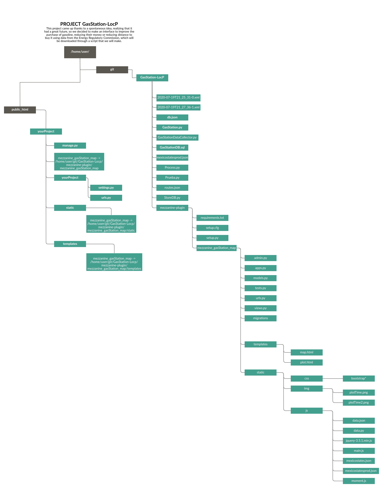

# Petrol and diesel stations
## Definition
This project came up thanks to a spontaneous idea, realizing that it had a great future, so we decided to make an interface to improve the purchase of gasoline, reducing their money or reducing distance to buy it using data from the Energy Regulatory Commission, which will be downloaded through a script that we will make.
## Overall Objectives
The objective of this project is to help people make decisions about where to buy their gasoline, the place that is closest to them but at the same time convenient for them in terms of price, among other things. One of the examples that we try to reduce is when you want to go to a gas station that is cheaper but is very far away, so you will get the same, you should go to one that is closer but is a little more expensive, so with this project we try to decide this type of issues.
## Software
In this project, most of the code is in Python with libraries like Pandas, Scrapy and some data visualization libraries, and some technology to work with maps, routes and layers.
## Architecture of the system
This proyect use Python v. 3.7, MySQLServer version: 8.0.21 MySQL Community Server - GPL, Django v. 1.11.29, Mezzanine v. 4.3.1. And libraries, an api, whatever it takes for to plot maps and routes.
###### Dependencies
1. Django Leaflet
     - ```pip install django-leaflet==0.26.0```
2. Matplotlib
     - ```pip install matplotlib==3.0.2```
3. MySQL
     - ```pip install mysql==0.0.2```
     - ```pip install mysql-connector==2.2.9```
     - ```pip install mysql-connector-python==8.0.21```
4. Numpy
     - ```pip install numpy==1.16```
5. Scrapy
     - ```pip install scrapy==2.0.0```
6. Urllib3
     - ```pip install urllib3==1.24.1```

## Data source
Our data source comes from the Energy Regulatory Commission, which is the Coordinated Energy Regulatory Body promoting the efficient development of the sector and the reliable supply of hydrocarbons and electricity.
https://datos.gob.mx/busca/dataset/estaciones-de-servicio-gasolineras-y-precios-finales-de-gasolina-y-diesel .
## Data collection
The process to obtain the data is through GasStation.by, which first extracts the download URL from the xml files using Scrapy, then sets the names to 0 for places and 1 for prices, plus the download datatime with extention xml , finally, they are added to a record csv with names date and type.
## Setup
- Install DB
```bash
$ mysql -u root -p #login in mysql to create the database
mysql> CREATE DATABASE GasStationDB
mysql> exit;
$ mysql -u root -p GasStationDB < GasStationDB.sql
```
- [install mezzanine-plugin](https://github.com/GustavoAlfredoZA/GasStation-LocP/blob/master/mezzanine-plugin/README.rst)
- #### Scripts
Change db.json with your mysql login credentials, paths.json lines 2 and 3, mezzanine-plugin / mezzanine_gasStation_map / views.py lines 47 and 49 based on [your directory tree](https://github.com/GustavoAlfredoZA/GasStation-LocP/blob/master/tree.jpg).
Run DataCollector.py, StoreDB.py and Process.py, ideally run in this order with a difference of 10 minutes between each, each day.
## Tree

## Results
#### Graph of fuel prices in Mexico

#### Michoacan Fuel Price Chart

#### Filtering

#### Graphics

#### Map

#### Table

